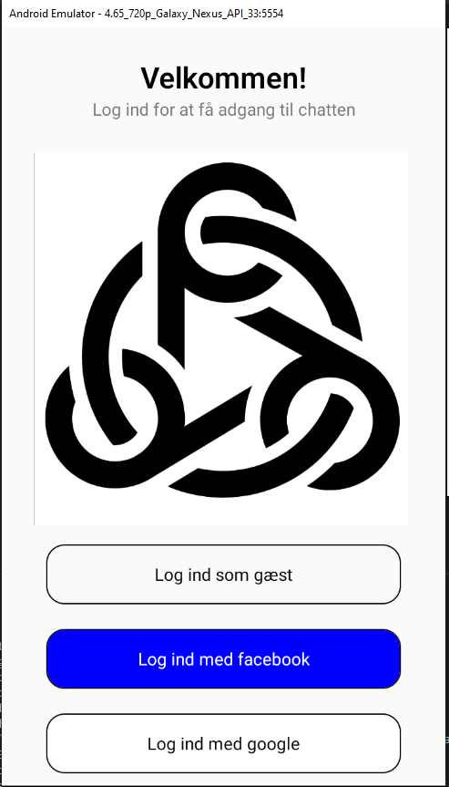
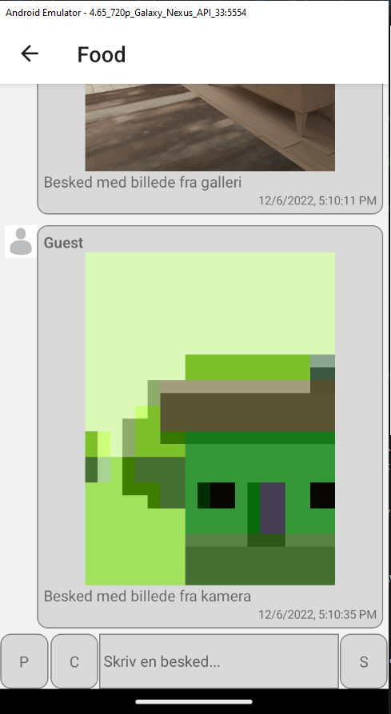
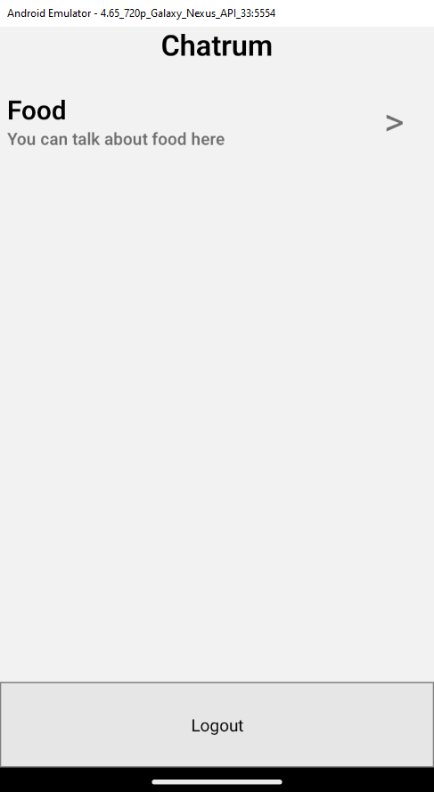

**What is this**

Its a chat application for mobile devices made in React Native (No Expo) based on Firebase API.

**Accept test status**

Splash screen
As a user I would like a nice and clean splash screen while the application loads.

Accepttest

    1. Splash loads while the application is loading up 🔴
    2. When finish next screen should fade in 🟢
    a. If you are logged in, go to Chat rooms 🟢
    b. If you are not logged in, go to Login screen 🟢

Login screen
As a user I would like to be able to login using my social login accounts.

Accepttest

    1. Add two sign in methods
        a. Facebook 🔴
        b. Google 🔴
    2. When signed in, i go to Chat rooms 🟢
    3. If error happens, user is shown a dialog 🟢

Chat rooms
As a user I would like to be shown a list of available rooms. The
list is sorted by newest message.

Accepttest

    1. A list is shown with the name and a short description of each room 🟢
    2. Each row have a chevron icon to the right indicating i can press 🟢
    3. The list is sorted by newest message 🔴
    4. I can pull to refresh to reload the list 🟢
    5. Pressing a room takes me to the send and receive screen 🟢

Send and receive messages
As a user I would like to be able to send and receive messages inside a chat room.

Accepttest

    1. Last 50 messages is loaded when chat room is opened 🔴
    2. Scroll to load more messages 🔴
    3. When a message is received it is automatically added to the list 🟢
    4. An input field at the bottom of the view should be shown
        a. When pressed the keyboard opens 🟢
        b. When message entered and user presses “Send” / “Enter” the message is sent and added to the list 🟢
    5. A message consists of
        a. Avatar of sender 🟢
        b. Name of sender 🟢
        c. Message date 🟢
        d. Message text 🟢

Push functionality
As a user I would like to receive a push message when a new message
is added to a room that I have participated in.

Accepttest

    1. When i write a message inside a room, then i am asked if i want to have notifications from that room 🔴
    2. Every time someone writes a message in the room, a push message is sent to me 🔴
    3. When the user presses a push message, he or she should be taken directly to the room/message (using deep links). 🔴

Upload of images to chat room
As a user I would like to be able to upload an image to a chat room.

Accepttest

    1. I can upload image from camera 🟢
    2. I can upload image from phone gallery 🟢
    3. Image is shown in the chat room in the same flow as messages 🟢

**Screenshots**

Screenshot of the login screen

Screenshot of the groupchat screen

Screenshot of the chatroom 'lobby'

Screenshot of firebase firestore contents

